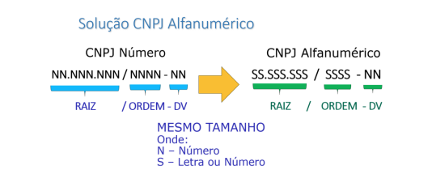
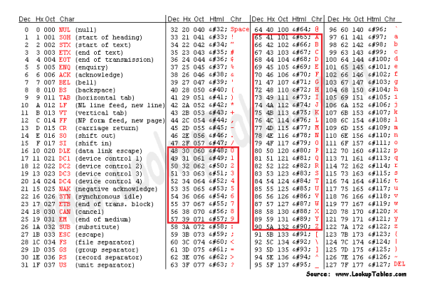
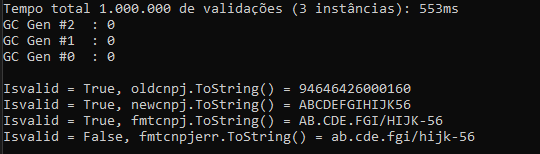

# Cnpj AlfaNumérico

A Receita Federal anunciou uma mudança no Cadastro Nacional de Pessoas Jurídicas, introduzindo um novo formato de identificação que combinará números e letras (CNPJ Alfanumérico), conforme a Nota Técnica COCAD/SUARA/RFB nº 49/2024.

### A fórmula de cálculo do dígito verificador do CNPJ Alfanumérico não muda: foi mantido o cálculo pelo módulo 11.

Porém, para garantir a utilização dos atuais números do CNPJ (tipo numérico), será necessária a alteração do modo como se calcula o dígito verificador pelo módulo 11. Serão utilizados, no cálculo do módulo 11, os valores relativos a letras maiúsculas lastreadas na tabela denominada código ASCII, como solução para unificar a representação de caracteres alfanuméricos. 

Na rotina de cálculo do Dígito Verificador (DV) no CNPJ, **serão substituídos os valores numéricos e alfanuméricos pelo valor decimal correspondente ao código constante na tabela ASCII** e dele subtraído o valor 48. Desta forma os caracteres numéricos continuarão com os mesmos montantes.

Os caracteres alfanuméricos terão os seguintes valores: **A=17, B=18, C=19…** e assim sucessivamente. Esta definição permitirá que o atual número do CNPJ tenha o mesmo cálculo do seu dígito verificador quando os sistemas iniciarem a identificação alfanumérica.

O desenho abaixo mostra a correspondência entre letras e números e seus 
respectivos valores na tabela ASCII:

# Creditos

Todo o código apresentado é de autoria de ao Elemar Júnior! apenas fizemos uma pequena alteração para contemplar os tipos letras (A~Z) 

ref: https://elemarjr.com/arquivo/validando-cnpj-respeitando-o-garbage-collector

# Resultados para 3.000.000 validações
